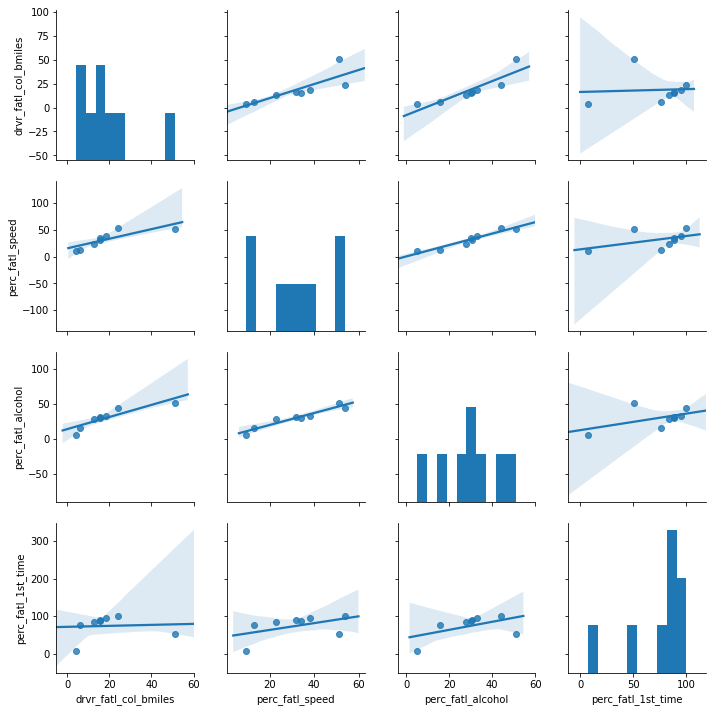
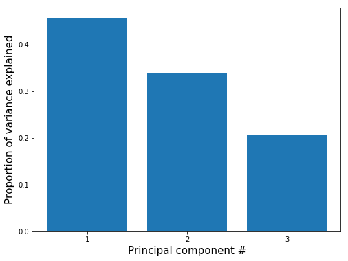
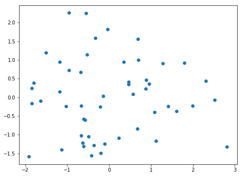
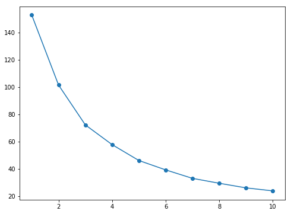
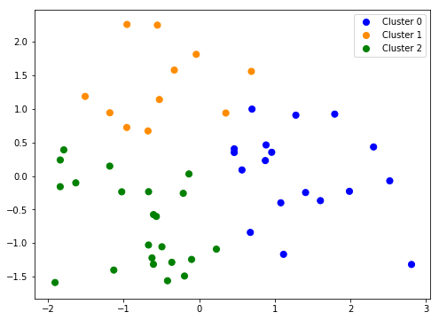
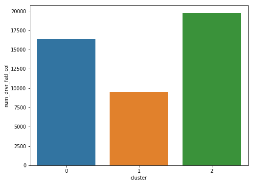

## Reducing Traffic Mortality in the USA  
  
### Project through DataCamp and designed by Joel Östblom and Rene Niehus:  
  
https://www.datacamp.com/projects/462  
  
Damon Resnick, 11/18/2018

## 1. The raw data files and their format
<p></p>
<p>While the rate of fatal road accidents has been decreasing steadily since the 80s, the past ten years have seen a stagnation in this reduction. Coupled with the increase in number of miles driven in the nation, the total number of traffic related-fatalities has now reached a ten year high and is rapidly increasing.</p>
<p>Per request of the US Department of Transportation, we are currently investigating how to derive a strategy to reduce the incidence of road accidents across the nation. By looking at the demographics of traffic accident victims for each US state, we find that there is a lot of variation between states. Now we want to understand if there are patterns in this variation in order to derive suggestions for a policy action plan. In particular, instead of implementing a costly nation-wide plan we want to focus on groups of  states with similar profiles. How can we find such groups in a statistically sound way and communicate the result effectively?</p>
<p>To accomplish these tasks, we will make use of data wrangling, plotting, dimensionality reduction, and unsupervised clustering.</p>
<p>The data given to us was originally collected by the National Highway Traffic Safety Administration and the National Association of Insurance Commissioners. This particular dataset was compiled and released as a <a href="https://github.com/fivethirtyeight/data/tree/master/bad-drivers">CSV-file</a> by FiveThirtyEight under the <a href="https://github.com/fivethirtyeight/data">CC-BY4.0 license</a>.</p>


```python
# # Check the name of the current folder in Windows. Use '!' to run from the jupyter notebook cell.
# current_dir = !cd
# print(current_dir)
# print("")

# # List all files in this folder
# file_list = !ls
# print(file_list)
# print("")

# List all files in the datasets directory
dataset_list = !ls datasets
print(dataset_list)
print("")

# View the first 20 lines of datasets/road-accidents.csv
accidents_head = !head -n 20 datasets/road-accidents.csv
accidents_head
```

    ['miles-driven.csv', 'road-accidents.csv']
    
    


    ['##### LICENSE #####',
     '# This data set is modified from the original at fivethirtyeight (https://github.com/fivethirtyeight/data/tree/master/bad-drivers)',
     '# and it is released under CC BY 4.0 (https://creativecommons.org/licenses/by/4.0/)',
     '##### COLUMN ABBREVIATIONS #####',
     '# drvr_fatl_col_bmiles = Number of drivers involved in fatal collisions per billion miles (2011)',
     '# perc_fatl_speed = Percentage Of Drivers Involved In Fatal Collisions Who Were Speeding (2009)',
     '# perc_fatl_alcohol = Percentage Of Drivers Involved In Fatal Collisions Who Were Alcohol-Impaired (2011)',
     '# perc_fatl_1st_time = Percentage Of Drivers Involved In Fatal Collisions Who Had Not Been Involved In Any Previous Accidents (2011)',
     '##### DATA BEGIN #####',
     'state|drvr_fatl_col_bmiles|perc_fatl_speed|perc_fatl_alcohol|perc_fatl_1st_time',
     'Alabama|18.8|39|30|80',
     'Alaska|18.1|41|25|94',
     'Arizona|18.6|35|28|96',
     'Arkansas|22.4|18|26|95',
     'California|12|35|28|89',
     'Colorado|13.6|37|28|95',
     'Connecticut|10.8|46|36|82',
     'Delaware|16.2|38|30|99',
     'District of Columbia|5.9|34|27|100',
     'Florida|17.9|21|29|94']


So we have 4 columns of data as described above with index being the state.  
  
drvr_fatl_col_bmiles: Number of drivers involved in fatal collisions per billion miles (2011)  
 
perc_fatl_speed: Percentage Of Drivers Involved In Fatal Collisions Who Were Speeding (2009)  

perc_fatl_alcohol: Percentage Of Drivers Involved In Fatal Collisions Who Were Alcohol-Impaired (2011)  

perc_fatl_1st_time: Percentage Of Drivers Involved In Fatal Collisions Who Had Not Been Involved In Any Previous Accidents  

## 2. Read in and get an overview of the data
<p>Next, we will orient ourselves to get to know the data with which we are dealing.</p>


```python
# All the packages and subpackages used:

# Pandas is a standard python data wrangling library
import pandas as pd

# Used in part 3.
# Import seaborn for dataviz and make plots appear inline
import seaborn as sns
%matplotlib inline

# Used in part 5.
# Import the linear model function from sklearn
from sklearn import linear_model

# Used in part 6
# Import StandardScaller from sklearn to standardize and center the feature columns
from sklearn.preprocessing import StandardScaler

# Import the PCA class function from sklearn to run PCA on standardized data
from sklearn.decomposition import PCA

# Import matplotlib for dataviz
import matplotlib.pyplot as plt

# Import numpy to use the round function
from numpy import round

# Used in part 8
# Import KMeans from sklearn to run clustering on preprocessed data
from sklearn.cluster import KMeans

# Used in part 9
# Try Bokeh for interactive dataviz.
import bokeh
from bokeh.plotting import figure, output_file, show
from bokeh.models import Legend
from bokeh.io import output_notebook
```


```python
# Read in dataset 'road-accidents.csv'
car_acc = pd.read_csv('datasets/road-accidents.csv', sep='|', comment='#')

# Save the number of rows columns as a tuple
rows_and_cols = car_acc.shape
print('There are {} rows and {} columns.\n'.format(
    rows_and_cols[0], rows_and_cols[1]))

# Generate an overview of the DataFrame
car_acc_information = car_acc.info()
print(car_acc_information)

# Display the last five rows of the DataFrame
car_acc.tail()
```

    There are 51 rows and 5 columns.
    
    <class 'pandas.core.frame.DataFrame'>
    RangeIndex: 51 entries, 0 to 50
    Data columns (total 5 columns):
    state                   51 non-null object
    drvr_fatl_col_bmiles    51 non-null float64
    perc_fatl_speed         51 non-null int64
    perc_fatl_alcohol       51 non-null int64
    perc_fatl_1st_time      51 non-null int64
    dtypes: float64(1), int64(3), object(1)
    memory usage: 2.1+ KB
    None
    


<div>
<style scoped>
    .dataframe tbody tr th:only-of-type {
        vertical-align: middle;
    }

    .dataframe tbody tr th {
        vertical-align: top;
    }

    .dataframe thead th {
        text-align: right;
    }
</style>
<table border="1" class="dataframe">
  <thead>
    <tr style="text-align: right;">
      <th></th>
      <th>state</th>
      <th>drvr_fatl_col_bmiles</th>
      <th>perc_fatl_speed</th>
      <th>perc_fatl_alcohol</th>
      <th>perc_fatl_1st_time</th>
    </tr>
  </thead>
  <tbody>
    <tr>
      <th>46</th>
      <td>Virginia</td>
      <td>12.7</td>
      <td>19</td>
      <td>27</td>
      <td>88</td>
    </tr>
    <tr>
      <th>47</th>
      <td>Washington</td>
      <td>10.6</td>
      <td>42</td>
      <td>33</td>
      <td>86</td>
    </tr>
    <tr>
      <th>48</th>
      <td>West Virginia</td>
      <td>23.8</td>
      <td>34</td>
      <td>28</td>
      <td>87</td>
    </tr>
    <tr>
      <th>49</th>
      <td>Wisconsin</td>
      <td>13.8</td>
      <td>36</td>
      <td>33</td>
      <td>84</td>
    </tr>
    <tr>
      <th>50</th>
      <td>Wyoming</td>
      <td>17.4</td>
      <td>42</td>
      <td>32</td>
      <td>90</td>
    </tr>
  </tbody>
</table>
</div>


## 3. Create a textual and a graphical summary of the data
<p>We now have an idea of what the dataset looks like. To further familiarize ourselves with this data, we will calculate summary statistics and produce a graphical overview of the data. The graphical overview is good to get a sense for the distribution of variables within the data and could consist of one histogram per column. It is often a good idea to also explore the pairwise relationship between all columns in the data set by using a using pairwise scatter plots (sometimes referred to as a "scatterplot matrix").</p>


```python
# Compute the summary statistics of all columns in the 'car_acc' DataFrame
sum_stat_car = car_acc.describe()
sum_stat_car
```


<div>
<style scoped>
    .dataframe tbody tr th:only-of-type {
        vertical-align: middle;
    }

    .dataframe tbody tr th {
        vertical-align: top;
    }

    .dataframe thead th {
        text-align: right;
    }
</style>
<table border="1" class="dataframe">
  <thead>
    <tr style="text-align: right;">
      <th></th>
      <th>drvr_fatl_col_bmiles</th>
      <th>perc_fatl_speed</th>
      <th>perc_fatl_alcohol</th>
      <th>perc_fatl_1st_time</th>
    </tr>
  </thead>
  <tbody>
    <tr>
      <th>count</th>
      <td>51.000000</td>
      <td>51.000000</td>
      <td>51.000000</td>
      <td>51.00000</td>
    </tr>
    <tr>
      <th>mean</th>
      <td>15.790196</td>
      <td>31.725490</td>
      <td>30.686275</td>
      <td>88.72549</td>
    </tr>
    <tr>
      <th>std</th>
      <td>4.122002</td>
      <td>9.633438</td>
      <td>5.132213</td>
      <td>6.96011</td>
    </tr>
    <tr>
      <th>min</th>
      <td>5.900000</td>
      <td>13.000000</td>
      <td>16.000000</td>
      <td>76.00000</td>
    </tr>
    <tr>
      <th>25%</th>
      <td>12.750000</td>
      <td>23.000000</td>
      <td>28.000000</td>
      <td>83.50000</td>
    </tr>
    <tr>
      <th>50%</th>
      <td>15.600000</td>
      <td>34.000000</td>
      <td>30.000000</td>
      <td>88.00000</td>
    </tr>
    <tr>
      <th>75%</th>
      <td>18.500000</td>
      <td>38.000000</td>
      <td>33.000000</td>
      <td>95.00000</td>
    </tr>
    <tr>
      <th>max</th>
      <td>23.900000</td>
      <td>54.000000</td>
      <td>44.000000</td>
      <td>100.00000</td>
    </tr>
  </tbody>
</table>
</div>


```python
# Create a pairwise scatter plot to explore the data
sns.pairplot(sum_stat_car, kind='reg', diag_kind='hist')
```


    <seaborn.axisgrid.PairGrid at 0x2c3b80e9278>





## 4. Quantify the association of features and accidents
<p>We can already see some potentially interesting relationships between the target variable (the number of fatal accidents) and the feature variables (the remaining three columns).</p>
<p>To quantify the pairwise relationships that we observed in the scatter plots, we can compute the Pearson correlation coefficient matrix. The Pearson correlation coefficient is one of the most common methods to quantify correlation between variables, and by convention, the following thresholds are usually used:</p>
<ul>
<li>0.2 = weak</li>
<li>0.5 = medium</li>
<li>0.8 = strong</li>
<li>0.9 = very strong</li>
</ul>


```python
# Compute the correlation coefficent for all column pairs
corr_columns = car_acc.corr()
corr_columns
```


<div>
<style scoped>
    .dataframe tbody tr th:only-of-type {
        vertical-align: middle;
    }

    .dataframe tbody tr th {
        vertical-align: top;
    }

    .dataframe thead th {
        text-align: right;
    }
</style>
<table border="1" class="dataframe">
  <thead>
    <tr style="text-align: right;">
      <th></th>
      <th>drvr_fatl_col_bmiles</th>
      <th>perc_fatl_speed</th>
      <th>perc_fatl_alcohol</th>
      <th>perc_fatl_1st_time</th>
    </tr>
  </thead>
  <tbody>
    <tr>
      <th>drvr_fatl_col_bmiles</th>
      <td>1.000000</td>
      <td>-0.029080</td>
      <td>0.199426</td>
      <td>-0.017942</td>
    </tr>
    <tr>
      <th>perc_fatl_speed</th>
      <td>-0.029080</td>
      <td>1.000000</td>
      <td>0.286244</td>
      <td>0.014066</td>
    </tr>
    <tr>
      <th>perc_fatl_alcohol</th>
      <td>0.199426</td>
      <td>0.286244</td>
      <td>1.000000</td>
      <td>-0.245455</td>
    </tr>
    <tr>
      <th>perc_fatl_1st_time</th>
      <td>-0.017942</td>
      <td>0.014066</td>
      <td>-0.245455</td>
      <td>1.000000</td>
    </tr>
  </tbody>
</table>
</div>


## 5. Fit a multivariate linear regression
<p>From the correlation table, we see that the amount of fatal accidents is most strongly correlated with alcohol consumption (first row). But in addition, we also see that some of the features are correlated with each other, for instance, speeding and alcohol consumption are positively correlated. We, therefore, want to compute the association of the target with each feature while adjusting for the effect of the remaining features. This can be done using multivariate linear regression.</p>
<p>Both the multivariate regression and the correlation measure how strongly the features are associated with the outcome (fatal accidents). When comparing the regression coefficients with the correlation coefficients, we will see that they are slightly different. The reason for this is that the multiple regression computes the association of a feature with an outcome, given the association with all other features, which is not accounted for when calculating the correlation coefficients.</p>
<p>A particularly interesting case is when the correlation coefficient and the regression coefficient of the same feature have opposite signs. How can this be? For example, when a feature A is positively correlated with the outcome Y but also positively correlated with a different feature B that has a negative effect on Y, then the indirect correlation (A-&gt;B-&gt;Y) can overwhelm the direct correlation (A-&gt;Y). In such a case, the regression coefficient of feature A could be positive, while the correlation coefficient is negative. This is sometimes called a <em>masking</em> relationship. Let’s see if the multivariate regression can reveal such a phenomenon.</p>


```python
# Create the features and target DataFrames
features = car_acc[['perc_fatl_speed', 'perc_fatl_alcohol', 'perc_fatl_1st_time']]
target = car_acc['drvr_fatl_col_bmiles']

# Import the linear model function from sklearn
from sklearn import linear_model

# Create a linear regression object
reg = linear_model.LinearRegression()

# Fit a multivariate linear regression model
reg.fit(X=features, y=target)

# Retrieve the regression coefficients
fit_coef = reg.coef_
fit_coef
```


    array([-0.04180041,  0.19086404,  0.02473301])


The middle number is the coefficient associated with alcohol consumption. This is clearly the strongest. However that feature does correlate strongly with the other features. More analysis is probably required.

## 6. Perform PCA on standardized data
<p>We have learned that alcohol consumption is weakly associated with the number of fatal accidents across states. This could lead us to conclude that alcohol consumption should be a focus for further investigations and maybe strategies should divide states into high versus low alcohol consumption in accidents. But there are also associations between  alcohol consumptions and the other two features, so it might be worth trying to split the states in a way that accounts for all three features.</p>
<p>One way of clustering the data is to use PCA to visualize data in reduced dimensional space where we can try to pick up patterns by eye. PCA uses the absolute variance to calculate the overall variance explained for each principal component, so it is important that the features are on a similar scale (unless we would have a particular reason that one feature should be weighted more).</p>
<p>We'll use the appropriate scaling function to standardize the features to be centered with mean 0 and scaled with standard deviation 1.</p>


```python
# Import StandardScaller from sklearn to standardize and center the feature columns
from sklearn.preprocessing import StandardScaler
scaler = StandardScaler()
features_scaled = scaler.fit_transform(features)

# Import the PCA class function from sklearn to run PCA on standardized data
from sklearn.decomposition import PCA
pca = PCA()

# Fit the standardized data to the pca object
pca.fit(features_scaled)

# Plot the proportion of variance explained on the y-axis of the bar plot
import matplotlib.pyplot as plt

plt.figure(figsize=(8, 6))
plt.bar(range(1, pca.n_components_ + 1),  pca.explained_variance_ratio_)
plt.xlabel('Principal component #', size=15)
plt.ylabel('Proportion of variance explained', size=15)
plt.xticks([1, 2, 3])
plt.show()

from numpy import round
# Compute the cumulative proportion of variance explained by the first two principal components
two_first_comp_var_exp = pca.explained_variance_ratio_.cumsum()[1]
print("The cumulative variance explained by the first two principal components is {}".format(round(two_first_comp_var_exp, 5)))
```





    The cumulative variance explained by the first two principal components is 0.7947
    

## 7. Visualize the first two principal components
<p>The first two principal components enable visualization of the data in two dimensions while capturing a high proportion of the variation (79%) from all three features: speeding, alcohol influence, and first-time accidents. This enables us to use our eyes to try to discern patterns in the data with the goal to find groups of similar states. Although clustering algorithms are becoming increasingly efficient, human pattern recognition is an easily accessible and very efficient method of assessing patterns in data.</p>
<p>We will create a scatter plot of the first principle components and explore how the states cluster together in this visualization.</p>


```python
# PCA transform the scaled features computing only the first two principal components
pca = PCA(n_components=2)
p_comps = pca.fit_transform(features_scaled)

# Extract the first and second component to use for the scatter plot
p_comp1 = p_comps[:, 0]
p_comp2 = p_comps[:, 1]

# Plot the first two principal components in a scatter plot
plt.figure(figsize=(8, 6))
plt.scatter(p_comp1, p_comp2)
plt.show()
```





## 8. Find clusters of similar states in the data
<p>It is not entirely clear from the PCA scatter plot how many groups into which the states cluster. To assist with identifying a reasonable number of clusters, we can use KMeans clustering by creating a scree plot and looking for the "elbow", which is an indication of when the addition of more clusters do not add much more explanatory power.</p>


```python
# Import KMeans from sklearn
from sklearn.cluster import KMeans

# A loop will be used to plot the explanatory power for up to 10 KMeans clusters
ks = range(1, 11)
inertias = []
for k in ks:
    # Initialize the KMeans object using the current number of clusters (k)
    km = KMeans(n_clusters=k, random_state=8)
    # Fit the scaled features to the KMeans object
    km.fit(features_scaled)
    # Append the inertia for 'km' to the list of inertias
    inertias.append(km.inertia_)
    
# Plot the results in a line plot
plt.figure(figsize=(8, 6))
plt.plot(ks, inertias, marker='o')
plt.show()
```





## 9. KMeans to visualize clusters in the PCA scatter plot
<p>Since there wasn't a clear elbow in the scree plot, assigning the states to either two or three clusters is a reasonable choice, and we will resume our analysis using three clusters. Let's see how the PCA scatter plot looks if we color the states according to the cluster to which they are assigned.</p>


```python
# Create a KMeans object with 3 clusters, using random_state=8 
km = KMeans(n_clusters=3, random_state=8)

# Fit the preprocessed data to the 'km' object
km.fit(features_scaled)

# Create the colors list to label each cluster with a different color using km.labels_
colors=[]
for x in km.labels_:
    if x == 0:
        colors.append('blue')
    elif x == 1:
        colors.append('darkorange')   
    else:
        colors.append('green')

# Create a new df with the 2 pcs, cluster labels, and colors as columns.
new = pd.DataFrame({'p_comp1':p_comp1, 'p_comp2':p_comp2,'clusters':km.labels_, 'colors':colors})

# Scatter plot of the first two principal components colored according to the KMeans cluster assignment
plt.figure(figsize=(8, 6))
plt.scatter(new['p_comp1'][new['clusters']==0], new['p_comp2'][new['clusters']==0], c=new['colors'][new['clusters']==0], s=50)
plt.scatter(new['p_comp1'][new['clusters']==1], new['p_comp2'][new['clusters']==1], c=new['colors'][new['clusters']==1], s=50)
plt.scatter(new['p_comp1'][new['clusters']==2], new['p_comp2'][new['clusters']==2], c=new['colors'][new['clusters']==2], s=50)
plt.legend(('Cluster 0', 'Cluster 1', 'Cluster 2'))
plt.show()
```





```python
# Try Bokeh as well to see how it looks
import bokeh
from bokeh.plotting import figure, output_file, show
from bokeh.models import Legend
from bokeh.io import output_notebook

p = figure(plot_width=500, plot_height=380)
p.scatter(new['p_comp1'][new['clusters']==0], new['p_comp2'][new['clusters']==0], fill_color=new['colors'][new['clusters']==0], size=8, legend=['Cluster 0'], line_color=None)
p.scatter(new['p_comp1'][new['clusters']==1], new['p_comp2'][new['clusters']==1], fill_color=new['colors'][new['clusters']==1], size=8, legend=['Cluster 1'], line_color=None)
p.scatter(new['p_comp1'][new['clusters']==2], new['p_comp2'][new['clusters']==2], fill_color=new['colors'][new['clusters']==2], size=8, legend=['Cluster 2'], line_color=None)

output_notebook()

# show the results
show(p)
```


    <div class="bk-root">
        <a href="https://bokeh.pydata.org" target="_blank" class="bk-logo bk-logo-small bk-logo-notebook"></a>
        <span id="1081">Loading BokehJS ...</span>
    </div>


  <div class="bk-root" id="56b691dc-55a8-4544-b751-c2e1c0f0beb0"></div>


We can see the separation of the 3 clusters for 2 principle components into 3 general regions. The clustering does make sense.

## 10. Visualize the feature differences between the clusters
<p>Thus far, we have used both our visual interpretation of the data and the KMeans clustering algorithm to reveal patterns in the data, but what do these patterns mean?</p>
<p>Remember that the information we have used to cluster the states into three distinct groups are the percentage of drivers speeding, under alcohol influence and that has not previously been involved in an accident. We used these clusters to visualize how the states group together when considering the first two principal components. This is good for us to understand structure in the data, but not always easy to understand, especially not if the findings are to be communicated to a non-specialist audience.</p>
<p>A reasonable next step in our analysis is to explore how the three clusters are different in terms of the three features that we used for clustering. Instead of using the scaled features, we return to using the unscaled features to help us interpret the differences.</p>


```python
# Create a new column in the original df with the labels from the KMeans clustering
car_acc['cluster'] = km.labels_

# Reshape the DataFrame to the long format to make the violin plots
melt_car = pd.melt(car_acc, id_vars=['cluster'], value_vars=['perc_fatl_speed', 'perc_fatl_alcohol', 'perc_fatl_1st_time'], 
                   var_name='measurement', value_name='percent')

# Create a violin plot splitting and coloring the results according to the km-clusters
plt.figure(figsize=(12, 12))
sns.violinplot(x='percent', y = 'measurement', hue='cluster', data=melt_car)
plt.show()

# plt.figure(figsize=(8, 12))
# sns.violinplot(x='measurement', y = 'percent', hue='cluster', data=melt_car)
# plt.show()
```


Each cluster looks to have a different distribution for each feature. This means that different groups of states have different responses.

## 11. Compute the number of accidents within each cluster
<p>Now it is clear that different groups of states may require different interventions. Since resources and time are limited, it is useful to start off with an intervention in one of the three groups first. Which group would this be? To determine this, we will include data on how many miles are driven in each state, because this will help us to compute the total number of fatal accidents in each state. Data on miles driven is available in another tab-delimited text file. We will assign this new information to a column in the DataFrame and create a bar plot for how many total fatal traffic accidents there are within each cluster of states.</p>


```python
# Read in the new dataset
miles_driven = pd.read_csv('datasets/miles-driven.csv', sep='|')

# Merge the 'car_acc' DataFrame with the 'miles_driven' DataFrame
car_acc_miles = car_acc.merge(miles_driven, on = 'state')

# Create a new column for the number of drivers involved in fatal accidents
car_acc_miles['num_drvr_fatl_col'] = car_acc_miles['drvr_fatl_col_bmiles'] * car_acc_miles['million_miles_annually'] / 1000

# Create a barplot of the total number of accidents per cluster
plt.figure(figsize=(8, 6))
sns.barplot(x='cluster', y='num_drvr_fatl_col', data=car_acc_miles, estimator=sum, ci=None)
plt.show()

# Calculate the number of states in each cluster and their 'num_drvr_fatl_col' mean and sum.
count_mean_sum = car_acc_miles.groupby('cluster')['num_drvr_fatl_col'].agg(['count', 'mean', 'sum'])
count_mean_sum
```





<div>
<style scoped>
    .dataframe tbody tr th:only-of-type {
        vertical-align: middle;
    }

    .dataframe tbody tr th {
        vertical-align: top;
    }

    .dataframe thead th {
        text-align: right;
    }
</style>
<table border="1" class="dataframe">
  <thead>
    <tr style="text-align: right;">
      <th></th>
      <th>count</th>
      <th>mean</th>
      <th>sum</th>
    </tr>
    <tr>
      <th>cluster</th>
      <th></th>
      <th></th>
      <th></th>
    </tr>
  </thead>
  <tbody>
    <tr>
      <th>0</th>
      <td>18</td>
      <td>911.406439</td>
      <td>16405.3159</td>
    </tr>
    <tr>
      <th>1</th>
      <td>11</td>
      <td>860.505945</td>
      <td>9465.5654</td>
    </tr>
    <tr>
      <th>2</th>
      <td>22</td>
      <td>898.378595</td>
      <td>19764.3291</td>
    </tr>
  </tbody>
</table>
</div>


The number of fatalities per cluster shown in the figure above correlates almost perfectly with the number of states in each cluster: 18, 11, 22 for clusters 0, 1, and 2 respectively. So this figure does not tell us much.

## 12. Make a decision when there is no clear right choice
<p>As we can see, there is no obvious correct choice regarding which cluster is the most important to focus on. Yet, given all the analysis a case must be made to focus on a certain cluster. Which cluster do you think should be a focus for policy intervention and further investigation?</p>


```python
# Which cluster would you choose?
cluster_num = 0
```

Cluster 0 seems to edge out the other clusters in having the highest mean percentage of fatalities due to both speed and alcohol. It also has a very wide distribution for speed and a bimodal distribution for alcohol. This may be a good place to start. We could start by thinking about ways to reduce accidents in Alabama, Missouri, North Carolina, Ohio, Pennsylvania, South Carolina, and Texas as these states have the largest number of fatalities. I would suggest focusing on general ways to reduce speeding accidents in these states as well as focusing on implementing policies to reduce alcohol related accidents.


```python
# States in cluster 0:
car_acc_miles[car_acc_miles['cluster']==0]
```


<div>
<style scoped>
    .dataframe tbody tr th:only-of-type {
        vertical-align: middle;
    }

    .dataframe tbody tr th {
        vertical-align: top;
    }

    .dataframe thead th {
        text-align: right;
    }
</style>
<table border="1" class="dataframe">
  <thead>
    <tr style="text-align: right;">
      <th></th>
      <th>state</th>
      <th>drvr_fatl_col_bmiles</th>
      <th>perc_fatl_speed</th>
      <th>perc_fatl_alcohol</th>
      <th>perc_fatl_1st_time</th>
      <th>cluster</th>
      <th>million_miles_annually</th>
      <th>num_drvr_fatl_col</th>
    </tr>
  </thead>
  <tbody>
    <tr>
      <th>0</th>
      <td>Alabama</td>
      <td>18.8</td>
      <td>39</td>
      <td>30</td>
      <td>80</td>
      <td>0</td>
      <td>64914</td>
      <td>1220.3832</td>
    </tr>
    <tr>
      <th>6</th>
      <td>Connecticut</td>
      <td>10.8</td>
      <td>46</td>
      <td>36</td>
      <td>82</td>
      <td>0</td>
      <td>31197</td>
      <td>336.9276</td>
    </tr>
    <tr>
      <th>11</th>
      <td>Hawaii</td>
      <td>17.5</td>
      <td>54</td>
      <td>41</td>
      <td>87</td>
      <td>0</td>
      <td>10066</td>
      <td>176.1550</td>
    </tr>
    <tr>
      <th>19</th>
      <td>Maine</td>
      <td>15.1</td>
      <td>38</td>
      <td>30</td>
      <td>84</td>
      <td>0</td>
      <td>14248</td>
      <td>215.1448</td>
    </tr>
    <tr>
      <th>25</th>
      <td>Missouri</td>
      <td>16.1</td>
      <td>43</td>
      <td>34</td>
      <td>84</td>
      <td>0</td>
      <td>68789</td>
      <td>1107.5029</td>
    </tr>
    <tr>
      <th>26</th>
      <td>Montana</td>
      <td>21.4</td>
      <td>39</td>
      <td>44</td>
      <td>85</td>
      <td>0</td>
      <td>11660</td>
      <td>249.5240</td>
    </tr>
    <tr>
      <th>29</th>
      <td>New Hampshire</td>
      <td>11.6</td>
      <td>35</td>
      <td>30</td>
      <td>83</td>
      <td>0</td>
      <td>12720</td>
      <td>147.5520</td>
    </tr>
    <tr>
      <th>33</th>
      <td>North Carolina</td>
      <td>16.8</td>
      <td>39</td>
      <td>31</td>
      <td>81</td>
      <td>0</td>
      <td>103772</td>
      <td>1743.3696</td>
    </tr>
    <tr>
      <th>34</th>
      <td>North Dakota</td>
      <td>23.9</td>
      <td>23</td>
      <td>42</td>
      <td>86</td>
      <td>0</td>
      <td>9131</td>
      <td>218.2309</td>
    </tr>
    <tr>
      <th>35</th>
      <td>Ohio</td>
      <td>14.1</td>
      <td>28</td>
      <td>34</td>
      <td>82</td>
      <td>0</td>
      <td>111990</td>
      <td>1579.0590</td>
    </tr>
    <tr>
      <th>38</th>
      <td>Pennsylvania</td>
      <td>18.2</td>
      <td>50</td>
      <td>31</td>
      <td>88</td>
      <td>0</td>
      <td>99204</td>
      <td>1805.5128</td>
    </tr>
    <tr>
      <th>39</th>
      <td>Rhode Island</td>
      <td>11.1</td>
      <td>34</td>
      <td>38</td>
      <td>79</td>
      <td>0</td>
      <td>7901</td>
      <td>87.7011</td>
    </tr>
    <tr>
      <th>40</th>
      <td>South Carolina</td>
      <td>23.9</td>
      <td>38</td>
      <td>41</td>
      <td>81</td>
      <td>0</td>
      <td>48730</td>
      <td>1164.6470</td>
    </tr>
    <tr>
      <th>41</th>
      <td>South Dakota</td>
      <td>19.4</td>
      <td>31</td>
      <td>33</td>
      <td>86</td>
      <td>0</td>
      <td>9002</td>
      <td>174.6388</td>
    </tr>
    <tr>
      <th>43</th>
      <td>Texas</td>
      <td>19.4</td>
      <td>40</td>
      <td>38</td>
      <td>87</td>
      <td>0</td>
      <td>237440</td>
      <td>4606.3360</td>
    </tr>
    <tr>
      <th>47</th>
      <td>Washington</td>
      <td>10.6</td>
      <td>42</td>
      <td>33</td>
      <td>86</td>
      <td>0</td>
      <td>56955</td>
      <td>603.7230</td>
    </tr>
    <tr>
      <th>49</th>
      <td>Wisconsin</td>
      <td>13.8</td>
      <td>36</td>
      <td>33</td>
      <td>84</td>
      <td>0</td>
      <td>58554</td>
      <td>808.0452</td>
    </tr>
    <tr>
      <th>50</th>
      <td>Wyoming</td>
      <td>17.4</td>
      <td>42</td>
      <td>32</td>
      <td>90</td>
      <td>0</td>
      <td>9245</td>
      <td>160.8630</td>
    </tr>
  </tbody>
</table>
</div>


